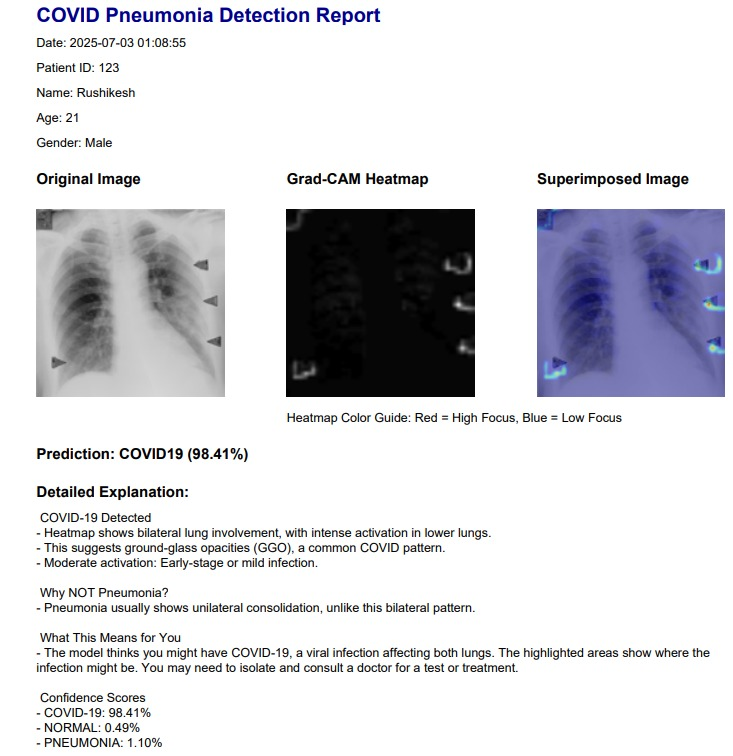

<<<<<<< HEAD
# 🧠 COVID-Pneumonia Chest X-ray Detection with CNN + Grad-CAM

This AI-powered desktop application detects **COVID-19**, **Pneumonia**, or **Normal** conditions from chest X-ray images using a custom-built Convolutional Neural Network (CNN). It includes Grad-CAM visualization and generates detailed PDF reports with medical explanations.

---

## ⚙️ Features

- 🧪 Detects **COVID-19**, **Pneumonia**, or **Normal** from X-ray images  
- 📊 Visualizes Grad-CAM heatmap for interpretability  
- 🖥️ Fully functional **Tkinter GUI**  
- 📄 Generates detailed **PDF reports** with predictions and explanations  
- 🧠 Trained on custom CNN with **focal loss** to handle class imbalance  
- 🔍 Explains *why* a class was predicted with side-by-side comparison  

---

## 🧠 Model Summary

- Input Image Size: `224 x 224`
- Architecture: Custom CNN (No pretrained models)
- Loss Function: Focal Loss
- Final Accuracy: **90%+** on test set
- Metrics: Accuracy, Precision, Recall, F1-Score, Confusion Matrix

---

# AI-Powered Diagnostic Tool for X-Ray Image Analysis

This AI-powered desktop application detects COVID-19, Pneumonia, or Normal conditions from chest X-ray images using a custom Convolutional Neural Network (CNN). It includes Grad-CAM visualization and can generate PDF reports with prediction details.

---

## Features

- Detects COVID-19, Pneumonia, or Normal from X-ray images
- Visualizes Grad-CAM heatmaps for interpretability
- Tkinter-based desktop GUI
- Generates PDF reports with predictions and explanatory notes
- Uses focal loss to handle class imbalance during training

---

## Model Summary (project-level info)

- Input Image Size: 224 x 224
- Architecture: Custom CNN (no pretrained backbone)
- Loss: Focal Loss
- Metrics: Accuracy, Precision, Recall, F1-Score, Confusion Matrix

---

## Sample Screenshots

GUI Preview


Graph Output


Model Predictions


Grad-CAM Heatmap


PDF Report


---

## How to run

1. Clone this repository

```powershell
git clone https://github.com/rajshinde9909/AI-Powered-Diagnostic-Tool-for-X-Ray-Image-Analysis.git
cd "AI-Powered-Diagnostic-Tool-for-X-Ray-Image-Analysis"
```

2. (Optional) Create a virtual environment and install dependencies

```powershell
python -m venv .venv
.\.venv\Scripts\Activate.ps1
pip install -r requirements.txt
```

3. Run the GUI (replace `GUI.ipynb` / `gui.py` with the appropriate entrypoint if present)

```powershell
python gui.py
# or open the notebook
jupyter notebook GUI.ipynb
```

---

If anything in the README needs to be adjusted to match your intended project name, entrypoint script, or usage, tell me and I'll update it.
